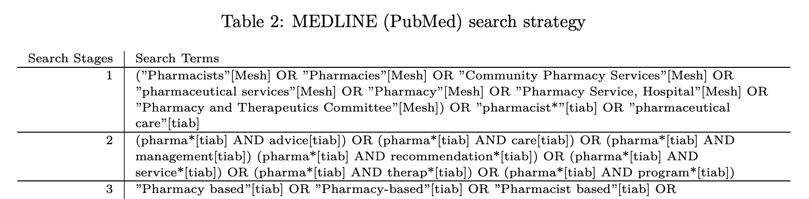

## Meeting Agenda

- Brief round of introductions
- Review of the protocol
- Review of project timeline
- Questions regarding project
- Next session
  - Training on SysRev
  - Establishing concordance
---

# Review of Protocol
---

## Introduction

- Division of Chronic Disease and Injury Prevention
  - Efforts to improve overall health of adults in the County
  - Broader Chronic Disease Prevention and Management Strategy (CDPMS)
- We want effective, innovative interventions
- Comprehensive Medication Management fits the bill.
- 
---

## Comprehensive Medication Management

-   Evolving health care methods
-   Several policy drivers

{width=45%}

-   Increasing costs of health care
-   An environment supporting **collaborative drug therapy models (CDTM)**
-   Leading to Medication Therapy Management (MTM)

---

## CMM Continued

:::: {.columns}

::: {.column width="50%"}

MTM strives to ensure

> patients receive best medication therapy to achive pharmacotherapeutic goals

- Medicare Part D environment

::: 

::: {.column width="50%"}

But CMM is different

:::
::::
---

## Why Chronic Diseases (e.g., Hypertension)?

- Chronic diseases impact significant portions of the population
- High economic and social burdens
- Hypertension is a starting point
  -   A risk factor for other diseases (e.g., heart disease, diabetes)
  -   A significant issue on its own.
---
## Why a Systematic Review?

-   There is increasing uptake of CMM interventions.
-   The novelty means there are discrepancies in implementation and results
-   A systematic review helps to

> identify, evaluate, and summarize

existing information.

## Systematic review purpose

:::: {.columns}

::: {.column width="50%"}

### Review Aim

We are aiming to investigate the effects of pharmacist-led CMM interventions on health related and economic outcomes in the United States.

:::

::: {.column width="50%"}

- Populations with high blood pressure or hypertension
- Delivery context (i.e., any health care environment)
  - Ambulatory/ inpatient/ community
  - Providers in different settings

:::
::::

## Steps in a Systematic Review

There are several steps:

1.   Question formulation
2.   Protocol development (remains ongoing until the end)
3.   Database searching (Active)
4.   Data extraction
5.   Appraisal
6.   Data synthesis
7.   Reporting (peer reviews/ official reports)

## Databases and Search Strategy

:::: {.columns}

::: {.column width="35%"}
### Databases

- MEDLINE
- CINAHL
- Cochrane Library
- EMBASE

:::

::: {.column width="65%"}
### Example of Strategy

{align="center" width=850%}

- MEDLINE (via PubMed) produced $\approx$ 120 citations
- With other databases and after de-duplication
  - Between 150-200 citations

:::

::::

## Project Tools

- Reference management software
  - Tracking citations and removing duplicates.

{width="15%"}

- Data extraction and cataloging software
  -   screening citations, full-text and data extraction.

{width="15%"}

## What We Will Do
:::: {.columns}

::: {.column width="50%"}

### Project State

- Protocol is complete
- Review is registered
- Search strategy finalized
- Pulling citations/references

:::

::: {.column width="50%"}

### You as a Collaborator

-   Screening Title/Abstract
-   Screening Full-text
-   Data extraction (later in the summer)

:::
::::

## What does it mean to screen?

- Trawling the databases produces numerous citations/references
  - Too much information to try and extract data.
- Narrow down to the relevant material (or close to it.)
- Screening is done using a list of criteria.
  - We include or exclude citations based on these criteria.

## Project Notes and Information

:::: {.columns}

::: {.column width="50%"}

### Project website

{fig-align="center" width=75%}

Contains all relevant project information.

<a href="https://butames.github.io/dphcmmsr">Project Website^[<b><https://butames.github.io/dphcmmsr></b>]</a>

:::

::: {.column width="50%"}

### What you will find

- Protocol Documents
  - Project rationale
  - Search strategies
- Training Materials
  - Presentations
  - Platform tutorials

:::
::::

# Any Questions?

{fig-align="center" width=25%}

## Project Timeline

{fig-align="center"}

- Title/Abstract screening will complete in early April
- Rest of April for Full-text screening

## In Prepartion for Next Week

- Go through the protocol documents via [project website](https://butames.github.io/dphcmmsr)
  - Focus on the section on inclusion criteria
- Shoot me an email if you have questions (sbutame@ph.lacounty.gov)

## Next Week Training

- Discuss finer details of the protocol (i.e., Inclusion criteria)
-	Walk through of the SysRev Platform
  -   An introduction to screening titles/ abstracts.
-	Jump in and do some screening

## After Tranining
- Collectively screen 10% of the corpus
-	Assess concordance (I will explain further next week)
- Then we begin officially!

# Thank you!

{fig-align="center" width=25%}
